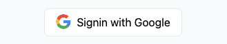
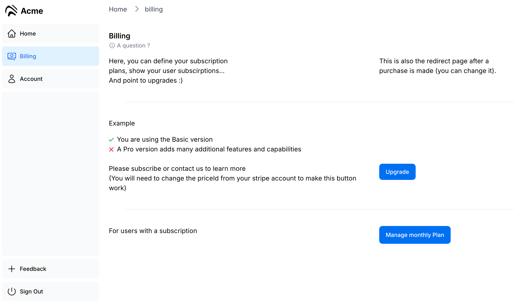

# Next.js Boilerplate for SoloPreneurs

A Next.js Starter Kit to build your idea with all you need to `earn $ in 1 hour`.


### Main Features

- ☀️ Free
- 👁️ [Landing page](https://nextjsboilerplate-blue.vercel.app/)
- 🔑 [Google SSO](https://nextjsboilerplate-blue.vercel.app/login) (NextAuth)
- 💰 Stripe for payments
- 📂 Postgres with Prisma 
- 📈 Google Analytics
- 📱 Responsive
- 📧 Mailgun
- 📦 SEO ⏳
- 📝 Blog ⏳
- 📚 Documentation ⏳
- 🔑 Customer support : impersonation
- 🫂 Customer support (chatwoot or chaty) ⏳
- 🍾 Referral program ⏳
- 🛠️ Customizable

⏳: Coming soon

### Why Choose This Next.js Boilerplate

As a solo founder, you need to focus on your product, not the tedious integrations with Stripe, Database, Auth, etc. This Next.js starter kit is designed to help you bypass these tasks and build and publish your product in a day.

As calculated by Marc Lou, the great inspiration for this project, the time saved is huge: **22 hours**

- 4 hrs to set up emails
- 6 hrs designing a landing page
- 4 hrs to handle Stripe webhooks
- 2 hrs for SEO tags
- 1 hr applying for Google Oauth
- 3 hrs for DNS records
- 2 hrs for protected API routes
- ∞ hrs researching...

### Pricing

This boilerplate is forever **Free**

But if you want to support the project, you can [buy me a coffee ☕️](https://patreon.com/guillim).

**Costs of Providers**

Running this project should costs `0 $`. The idea is you can test 10 products without ruining yourself !

That's why I only selected providers (see [tech stack](#tech-stack) below) with a good free tier (at the time I selected them of course).

## Get Started
Setup your environment : 
_Copy the file [.env.example](./.env.example) to [.env](.env) and fill in the variables_

#### Development
Install dependencies and run the project :
```bash
pnpm install
npx prisma migrate dev --name init
pnpm run dev
```

open [http://localhost:3000/](http://localhost:3000/) to see the result

#### Production
For production, we recommend using vercel (see below)
```bash
pnpm run build
pnpm run start
```
## Tech Stack

It's all Typescript
It's the App Router type of Next.js project
It uses Postgres, hosted on [Neon](https://neon.tech/) for the database, but you can change it if you want.
It's documented to guide you through the process of customizing it.
It's React for the frontend, with TailwindCSS for the design.
It's easy to be host on [Vercel](https://vercel.com/), but you can change it.
It will be automatically deployed on git push, no worries about that, focus on code.


- Hosting : Vercel

Visit [vercel](https://vercel.com/signup) to create an account. Choose the free "hobby" plan. Select Continue with GitHub to connect your GitHub and Vercel accounts. Read [this page](https://nextjs.org/learn/dashboard-app/setting-up-your-database) if you are stuck

- 📂 Database : Neon

We do not chose Vercel Postgresql because it's not free. Neon is a great alternative, and it's free. Visit [Neon](https://neon.tech/) to create an account. Choose the free plan. Read [this page](https://neon.tech/docs/guides/nextjs)

We user [Prisma](https://www.prisma.io/docs/getting-started/setup-prisma/start-from-scratch/relational-databases-typescript-postgresql) to connect to the database. Very useful to be error-proof.

More info in our [prisma/README.md file](prisma/README.md)

- Landing Page

Once you run the project, you can access the landing page at [localhost:3000](http://localhost:3000/).
Feel free to customize it as you want in the folder `(landing-page)`.


- 🔑 Auth

Google Auth is already set up. To use it. please follow this [guide](https://authjs.dev/getting-started/authentication/oauth) TLDR, it begins with creating a project on the [Google Cloud Platform](https://console.cloud.google.com/apis/credentials).  

We recommend reading [NextAuth](https://next-auth.js.org/getting-started/introduction) for other easy ways to authenticate users (google, twitter, github...)




Impersonation: For better support, you can log in as any user. Simply add your own user ID to **.env** `NEXT_PUBLIC_ADMIN_USER_ID=` and visit [/login/impersonate](/login/impersonate)

- 💰 Payment : Stripe

We use Stripe for payments. Please create an account here [Stripe](https://stripe.com/).
To make things simpler, Stripe is related to a company, not a user here. So, for every user, a company is automatically created. 

For setup, read this [Stripe Tutorial](https://medium.com/@rakeshdhariwal61/integrating-stripe-payment-gateway-in-next-js-14-a-step-by-step-guide-1bd17d164c2c). Use [the Stripe test card](https://docs.stripe.com/testing) for testing.




<details>
<summary>One click button</summary>

How to integrate Stripe button ? You simply need to add this to make the payment work (just change for the correct priceId):
```react
<SubscribeComponent 
        priceId="price_1Q6U4ZP9VWutz4pQA1UC2ilX" 
        price="10" 
        description="Basic Plan" />
```
This is already included in the [billing](/billing) page

</details>

<details>
<summary>Customer Portal</summary>

Don't worry about handling invoices and managing subscriptions. Stripe has a [customer portal](https://stripe.com/docs/billing/subscriptions/customer-portal) doing that for you. 

You users can connect directly with their email, it looks like this: [https://billing.stripe.com](https://billing.stripe.com/p/session/test_YWNjdF8xR3kxaUZBbHF2S3B4SkN1LF9SOEN5QTN0aGVrNFpWTHExWWNMaW1EWnE5Y29tOE1o0100dW7QNfxX)

This is already included in the [billing](/billing) page

</details>
<br/>

- 📈 Google Analytics

We use Google Analytics to track the users. Please create an account here [Google Analytics](https://analytics.google.com/). Then add your id in the [.env](./.env) file
```markdown
# Google Analytics
NEXT_PUBLIC_GOOGLE_ANALYTICS_ID=G-xxxxxxx
```

- ✉️ Email : Mailgun
Mailgun offers 100 free emails per day which is the biggest free plan we found during our research. Create an account [here](https://signup.mailgun.com/new/signup?plan_name=dev_free&currency=USD). 
    - Create an API key in the [API key section](https://app.mailgun.com/settings/api_security)
    - Then add it to the [.env](./.env) file
    - then adapt this piece of code to your needs, but make sure you change 'mail.mydomain.com' to your mail domain as setup in mailgun:
```ts
// On your pages/api routes:
import { mailgunClientGlobal } from '@/infra/mailgun';
const mg = await mailgunClientGlobal
await mg.mailgun?.messages.create(
  'mail.mydomain.com',
  {...mg.getDefaultValues(), 
    from: 'Excited User <mailgun@mail.mydomain.com>',
    to: ['contact@mydomain.uk'] }
);
```
Note : If your mail server in not in europe, you may comment out one line here : [mailgun.ts](./infra/mailgun.ts) 
`url: 'https://api.eu.mailgun.net'` since it's specific for EU servers.

- IDE : VScode

We recommend using VScode for the project, as it's the most popular editor for web development.
ESlint is automatic on save to get a better developer experience.

- Code hosting : Github Repository

To host your code on Github, please follow this [guide](https://help.github.com/en/github/getting-started-with-github/create-a-repo).


### Thanks

It's based on the Next.js (App Router) starter template.
For customisation, see the [course](https://nextjs.org/learn) on the Next.js Website.

### License
MIT